# Impact Sentinel — High-Level Architecture

**Status:** Design outline and diagrams only (no implementation in this phase)
**Companion docs:** [requirements.md](requirements.md), [stories.md](stories.md)

This document names the major components, how they collaborate, and how they map onto the product. The public website is **Flask** (`src/app.py`). Collector and analyzer remain separate backend processes. It is not a class-level design and it does not prescribe library versions beyond what the running stack uses.

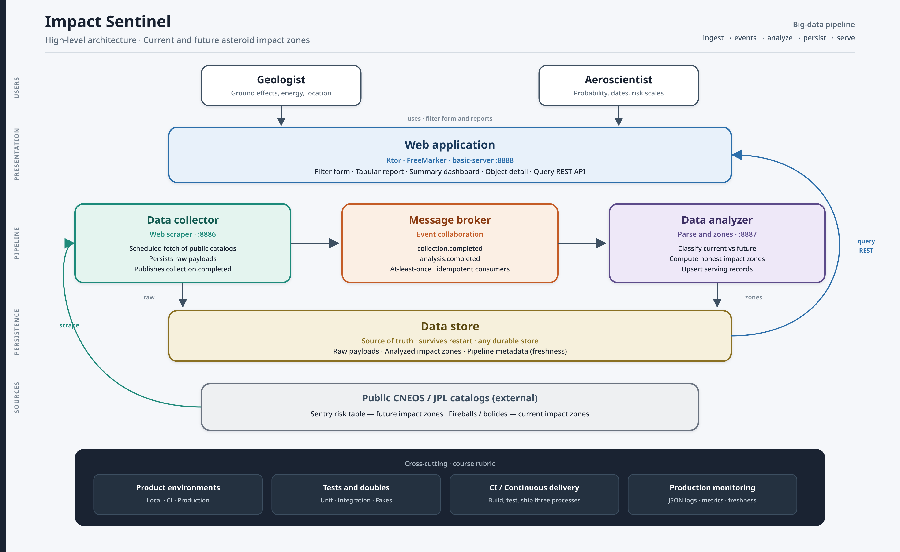

PNG: [diagrams/impact-sentinel-high-level.png](diagrams/impact-sentinel-high-level.png) · SVG source: [diagrams/impact-sentinel-high-level.svg](diagrams/impact-sentinel-high-level.svg)

---

## 1. High-level outline of major components

1. **Public data sources** — CNEOS Sentry (future risk), CNEOS Fireballs (current observed events), optional close-approach pages. Not owned by us.
2. **Data collector** — scheduled web scraper. Fetches sources, stores raw payloads, publishes `collection.completed`.
3. **Message broker** — event collaboration between collector and analyzer (`collection.completed`, `analysis.completed`).
4. **Data analyzer** — parses raw payloads, classifies current vs future, computes impact zones, upserts serving records, publishes `analysis.completed`.
5. **Data store** — durable persistence for raw payloads, analyzed zones, and pipeline metadata. Source of truth if messages are lost.
6. **REST layer** — public JSON query API (list/get zones) and internal health/status APIs on each process.
7. **Web application** — server-rendered filter form and reports (tabular + summary + detail). Reads the serving store/API only.
8. **Instrumentation** — structured JSON logs, metrics, health probes, freshness/stale detection.
9. **Product environments** — local, CI, production (staging recommended), isolated stores, env-var config.
10. **CI/CD** — build and test on every push; ship JARs/images that passed tests; deploy the three processes independently.

These ten items are the product. Everything else (templates, Gradle modules, Docker) is packaging.

---

## 2. Mapping onto the starter repo

The starter is already an application-continuum style system: one web app and two background workers. Impact Sentinel fills those boxes; it does not replace them.

| Component | Starter module | Runtime process | Default port (compose) |
| --- | --- | --- | --- |
| Web application | `src/app.py` (Flask) | `flask run` / Gunicorn | 5000 locally; `$PORT` on Heroku |
| Data collector process | `applications/data-collector-server` | `data-collector` | 8886 |
| Collector work | `components/data-collector` (`WorkFinder` / `Worker`) | same JVM as collector server | — |
| Data analyzer process | `applications/data-analyzer-server` | `data-analyzer` | 8887 |
| Analyzer work | `components/data-analyzer` | same JVM as analyzer server | — |
| Scheduling | `support/workflow-support` (`WorkScheduler`) | inside collector and analyzer | — |
| JSON logging | `support/logging-support` | all processes | — |
| Packaging | `Dockerfile`, `docker-compose.yaml`, `Procfile` | one image, `APP` selects the JAR | — |

**Not in the starter today (specified here, not implemented in this phase):**

- Data store
- Message broker
- Real scrape / parse / zone logic
- Filter form and reports
- Query REST API and health/status bodies
- CI workflow, metrics endpoint, staging/production config

---

## 3. Big-data pipeline shape

Impact Sentinel is a small instance of a standard ingest–process–serve pipeline:

| Layer | What it does here |
| --- | --- |
| **Sources** | Public web catalogs of NEOs and fireballs |
| **Ingest (speed + batch)** | Collector scrapes on a schedule (batch refresh) and emits an event per successful fetch (speed path) |
| **Buffer** | Message broker plus unprocessed raw rows in the store |
| **Process** | Analyzer normalizes, classifies, computes zones |
| **Serving store** | Durable analyzed records |
| **Serve** | REST + web reports |

This is a **lambda-style** split without a separate batch cluster:

- **Batch path:** scheduled full fetch of the Sentry table and Fireballs listing.
- **Speed path:** `collection.completed` → analyzer immediately.
- **Serving path:** web and REST read only analyzed rows.
- **Recovery path:** analyzer scans unprocessed raw rows if a message was dropped.

The store, not the broker, is the source of truth (SR-EVT-04).

---

## 4. System context

Geologists and aeroscientists use one workstation. The product is the only system we build. NASA/JPL public pages are an external system we scrape.

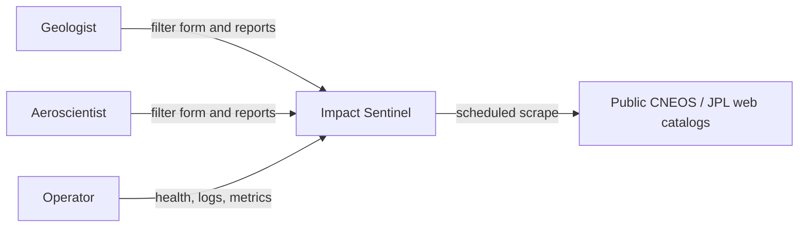

---

## 5. Container diagram (major runtime pieces)

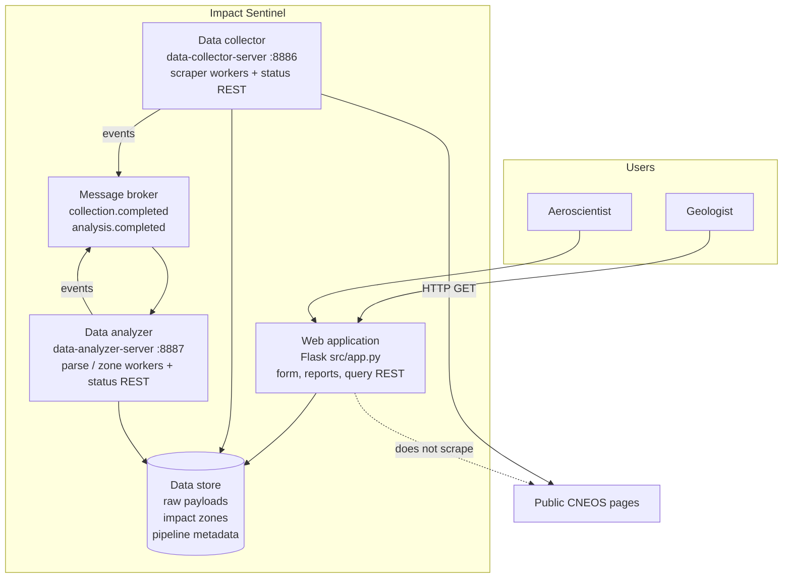

Notes:

- Collector and analyzer each expose **internal REST** (liveness/last-run) in addition to doing work.
- The web process exposes **user REST** (`/api/...` query) plus HTML.
- Dashed line: the browser never talks to CNEOS; the web app never scrapes on page load.

---

## 6. Component responsibilities

### 6.1 Web application

**Does**

- Render the filter form (UR-05). The first implemented slice is the public Flask form in `src/app.py`.
- Render tabular report, summary report, and detail (UR-04, UR-08, UR-09).
- Validate filters; show empty and error states.
- Expose JSON query API that matches the form (SR-API-01).
- Show freshness and stale warnings from pipeline metadata.
- Serve static CSS/images.

**Does not**

- Call public NEO sites.
- Compute Palermo/Torino scales or impact radii (that is analyzer work).
- Own scheduling.

**Depends on:** data store (read) or query API in-process; health of workers is displayed, not required for read.

### 6.2 Data collector

**Does**

- On `WorkScheduler` ticks, fetch configured source URLs.
- Persist raw payloads (body, URL, status, collected-at UTC).
- Publish `collection.completed`.
- Expose `/health` and last-run status.
- Rate-limit and identify itself.

**Does not**

- Interpret HTML into zones.
- Serve user reports.

**Depends on:** public HTTP, data store (write raw), message broker (best-effort publish).

### 6.3 Data analyzer

**Does**

- Consume `collection.completed` and scan unprocessed raw rows.
- Parse fixtures/sources into a normalized schema.
- Classify **current** vs **future**.
- Compute impact zone per requirements §8 (no fabricated coordinates).
- Idempotent upsert of serving records.
- Publish `analysis.completed`.
- Mark poison payloads failed and continue.

**Does not**

- Fetch the public web (unless a future optimization is explicitly added; default is store-only input).
- Render HTML.

**Depends on:** data store (read raw, write zones), message broker (consume/produce).

### 6.4 Data store

Logical entities (any durable store; relational is the intended default):

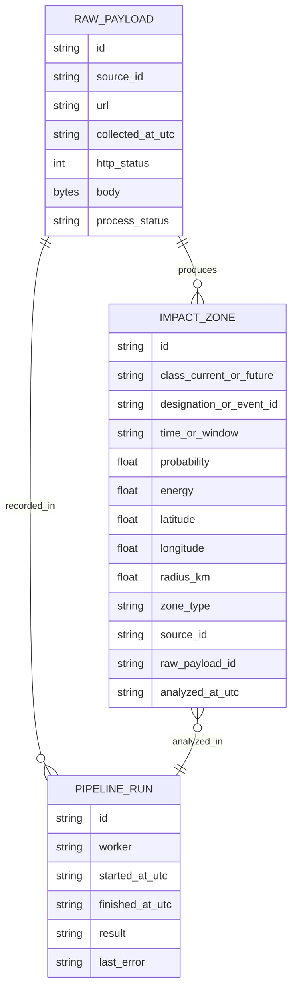

`process_status` on raw payloads supports the recovery path: `pending` | `processed` | `failed`.

### 6.5 Message broker

| Topic / queue | Producer | Consumer | Meaning |
| --- | --- | --- | --- |
| `collection.completed` | Collector | Analyzer | Raw payload `id` is ready |
| `analysis.completed` | Analyzer | Web (optional invalidation) or operators | Serving rows for that payload are updated |

Event envelope (logical):

```text
correlation_id
payload_id
source_id
occurred_at_utc
event_type
```

Delivery is **at-least-once**. Consumers must be idempotent (US-20).

### 6.6 REST collaboration

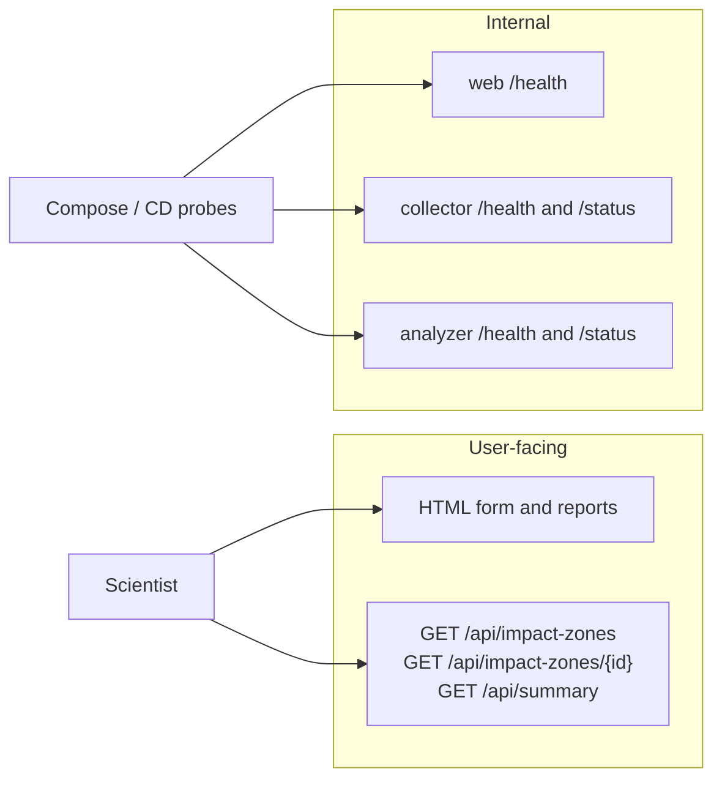

| Surface | Process | Role |
| --- | --- | --- |
| HTML pages | web | Form + reporting |
| `/api/impact-zones` | web | REST collaboration for clients and the UI |
| `/health` | all three | Liveness; must not call CNEOS |
| `/status` | collector, analyzer | Last success, last error, last counts |

HTTP mapping: 200 ok, 400 bad filters, 404 missing id, 503 if the **store** is down (not if CNEOS is down).

---

## 7. Data flow (happy path)

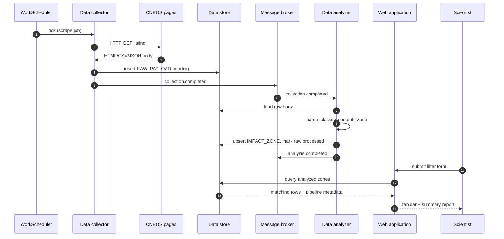

### Failure and recovery (broker down)

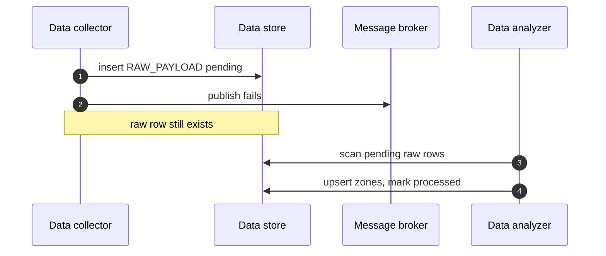

---

## 8. Current vs future impact zones

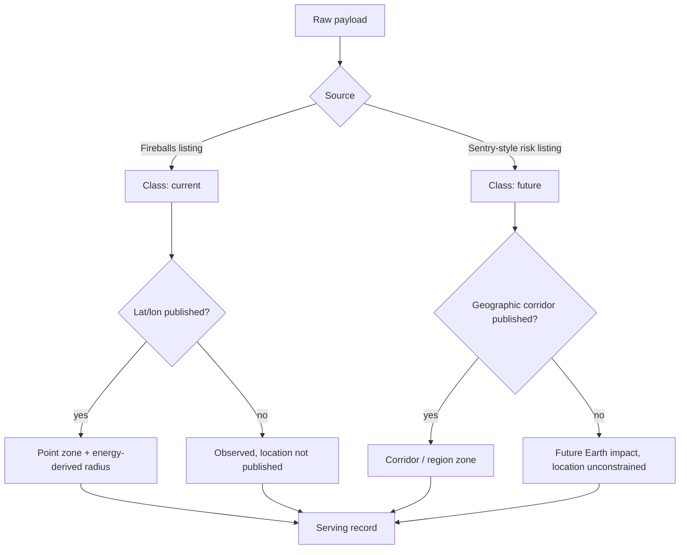

The web UI displays `zone_type`; it never geocodes a country from probability.

---

## 9. Product environments

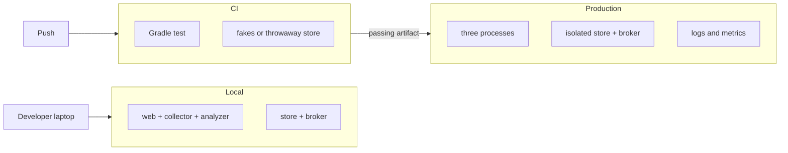

| Environment | Purpose | Data | Config |
| --- | --- | --- | --- |
| **local** | Develop against Compose | Disposable | `.env` / exported vars |
| **ci** | Prove tests on a clean agent | Fakes or ephemeral store; never production | CI secrets only as needed for none of CNEOS |
| **production** | Scientists use it | Isolated durable store | Injected at deploy: URLs, intervals, store, broker |

Recommended later: **staging** as a production-like deploy of the same artifact.

Configuration is environment variables (already how `PORT` and `APP` work):

| Variable (logical name) | Used by |
| --- | --- |
| `PORT`, `APP` | All processes (starter) |
| Store location / JDBC-style URL | All that persist |
| Broker URL | Collector, analyzer |
| Source URLs and scrape interval | Collector |
| Freshness threshold | Web, analyzer, monitoring |

---

## 10. Test strategy (including doubles)

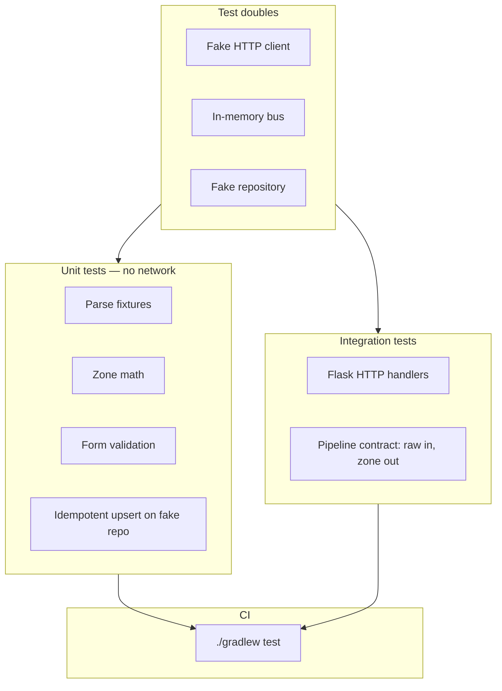

| Double | Replaces | Used in |
| --- | --- | --- |
| Fake HTTP client | Live CNEOS | Collector unit tests |
| In-memory publisher/subscriber | Kafka/RabbitMQ-class broker | Collector/analyzer unit tests |
| Fake zone/raw repository | Durable store | Web, analyzer, collector unit tests |

Workers depend on **interfaces** (HTTP, store, bus). Production adapters and test doubles both implement those interfaces (SR-TD-04). Integration tests still must not call live CNEOS (SR-IT-03).

---

## 11. Continuous integration and delivery

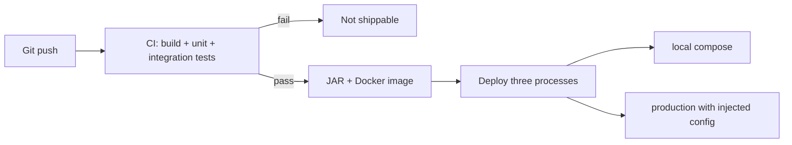

- **CI (SR-CI):** every push to the integration branch; fail the build on test failure; no production store access.
- **CD (SR-CD):** only artifacts that passed CI; one image, three `APP` values; config at deploy time; processes independently restartable.

This matches the existing `Dockerfile` (copies all three JARs, `APP` selects which to run) and `docker-compose.yaml` (three services, three ports).

---

## 12. Production monitoring and instrumentation

Cross-cutting on every process. The starter already writes **JSON logs** to stderr (`support/logging-support`). Impact Sentinel extends that with fields and metrics; it does not require a specific SaaS vendor.

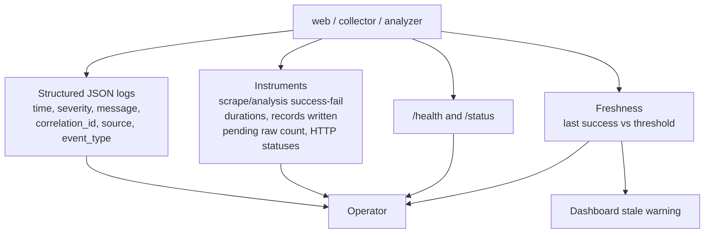

Minimum instruments (SR-MON-02):

- `collection.success` / `collection.failure` (count)
- `collection.duration` (timer)
- `analysis.success` / `analysis.failure` (count)
- `analysis.duration` (timer)
- `records.written` (count)
- `raw.pending` (gauge) — consumer lag analog
- HTTP request count by status for web and REST

Stale data: if last successful collection or analysis is older than the configured threshold, set a metric/flag **and** label the web summary (UR-12, US-40). Silence is not “all clear.”

---

## 13. How the rubric sits on this picture

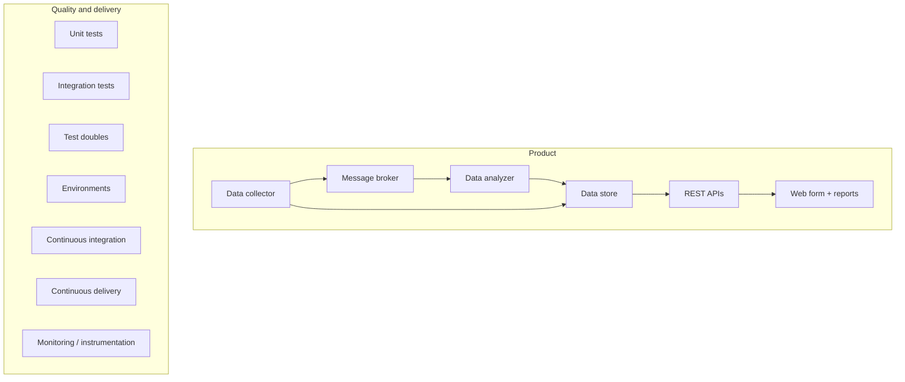

| Rubric item | Where it lives in this architecture |
| --- | --- |
| Web application — form, reporting | Web application container (§6.1) |
| Data collection | Data collector + scheduler (§6.2) |
| Data analyzer | Data analyzer (§6.3) |
| Unit tests | Parse/zone/form tests with fixtures (§10) |
| Data persistence | Data store (§6.4) |
| REST collaboration | Query API + per-process health/status (§6.6) |
| Product environment | local / ci / production (§9) |
| Integration tests | HTTP + pipeline contract (§10) |
| Mock objects / test doubles | Fake HTTP, bus, repository (§10) |
| Continuous integration | Push → Gradle test (§11) |
| Production monitoring | Logs, metrics, health, freshness (§12) |
| Event collaboration | Broker topics (§6.5, §7) |
| Continuous delivery | Tested image, three processes, config at deploy (§11) |

---

## 14. Design decisions (documentation phase)

| Decision | Choice | Why |
| --- | --- | --- |
| Three processes | Keep starter split: web, collector, analyzer | Matches the assigned architecture and Compose layout |
| Collector is a scraper | Fetch public CNEOS listings; persist raw | Assignment: data collector = web scraper |
| Analyzer does not scrape | Reads store / events only | Clear stage boundary; reproducible analysis |
| Store is source of truth | Broker is the fast path | Survives missed messages; simpler ops |
| Honest zones | Null coordinates when unpublished | Scientific integrity (UR-14) |
| Server-rendered web first | Flask templates and a basic form | Course stack; rubric asks for basic form + reporting, not a SPA |
| Any durable store | PostgreSQL-class intended, not mandatory | Rubric: any data store |
| Any at-least-once broker | Kafka or RabbitMQ class | Rubric: event collaboration; choice is implementation |
| No auth in v1 | Shared workstation | Keeps this phase to monitoring + pipeline |
| No code in this phase | Docs only | Explicit instruction |

---

## 15. What this phase does not produce

- No Kotlin changes, no Gradle/CI files, no Docker service for store/broker yet
- No chosen cloud, no vendor lock-in for metrics
- No pixel mockups; the form and reports are specified by fields in requirements and stories
- No PR plan — implementation comes after these documents are accepted

When implementation starts, the first vertical slice suggested by the stories is: fake-source collector → store raw → analyzer fixture → one zone in the store → form + table + `GET /api/impact-zones`. Messaging, CI, and metrics then attach to that slice rather than the other way around.
